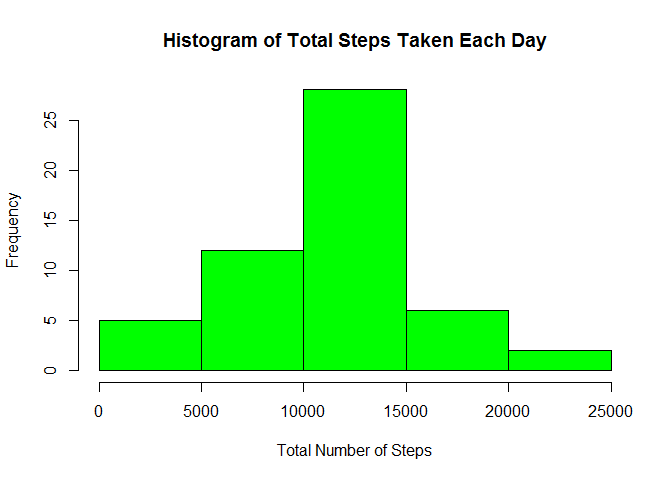
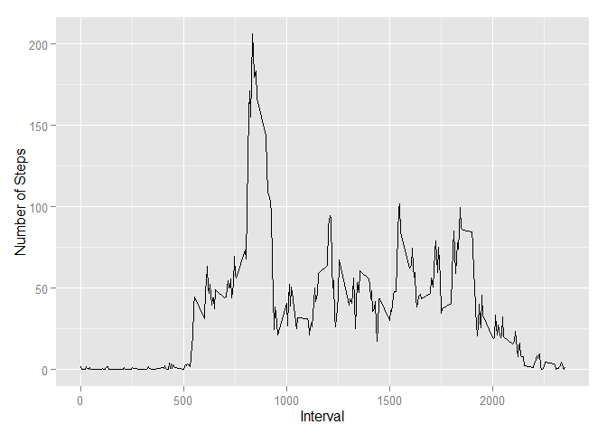
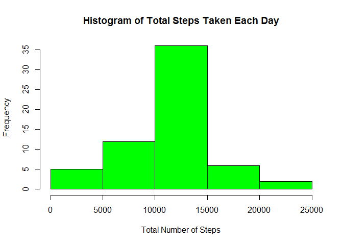
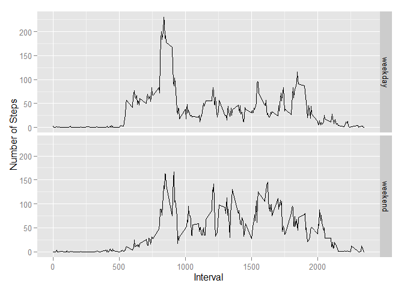

# Reproducible Research: Peer Assessment 1
K Ryan  
January 24, 2016  


## Loading and preprocessing the data

This step has 3 commands:  
        1. read in the activity.csv file  
        2. make sure the date column is in Date format  
        3. Remove the NAs for the first couple of steps


```r
#load the libraries needed for the code
library(dplyr)
```

```
## Warning: package 'dplyr' was built under R version 3.2.2
```

```
## 
## Attaching package: 'dplyr'
## 
## The following objects are masked from 'package:stats':
## 
##     filter, lag
## 
## The following objects are masked from 'package:base':
## 
##     intersect, setdiff, setequal, union
```

```r
library(ggplot2)

##Read in datafile
datatable <- read.csv("activity.csv")

##Make date variable Date class
datatable$date <- as.Date(datatable$date,"%Y-%m-%d")

##Remove NAs and make new dataset
noNAdatatable <- datatable[complete.cases(datatable),]
```

## What is mean total number of steps taken per day?
This step requires:  
        1. a histogram of the total number of steps taken each day.  
        2. A table of the mean/median steps taken each day


```r
##Create a summary of mean steps per day
countSteps <- noNAdatatable %>% 
        group_by(date) %>% 
        summarize(totalSteps = sum(steps))

##Create a histogram from that summary
hist(countSteps$totalSteps, col = "green", xlab = "Total Number of Steps",
     main = "Histogram of Total Steps Taken Each Day")
```

 

```r
##Mean and median number of steps taken each day

##Create a summary of mean steps per day
meanMedianSteps <- noNAdatatable %>% 
        group_by(date) %>% 
        summarize(meanSteps = mean(steps), medianSteps = median(steps))
```

###Table of Mean and Median Steps Per Day

```r
print.data.frame(meanMedianSteps)
```

```
##          date  meanSteps medianSteps
## 1  2012-10-02  0.4375000           0
## 2  2012-10-03 39.4166667           0
## 3  2012-10-04 42.0694444           0
## 4  2012-10-05 46.1597222           0
## 5  2012-10-06 53.5416667           0
## 6  2012-10-07 38.2465278           0
## 7  2012-10-09 44.4826389           0
## 8  2012-10-10 34.3750000           0
## 9  2012-10-11 35.7777778           0
## 10 2012-10-12 60.3541667           0
## 11 2012-10-13 43.1458333           0
## 12 2012-10-14 52.4236111           0
## 13 2012-10-15 35.2048611           0
## 14 2012-10-16 52.3750000           0
## 15 2012-10-17 46.7083333           0
## 16 2012-10-18 34.9166667           0
## 17 2012-10-19 41.0729167           0
## 18 2012-10-20 36.0937500           0
## 19 2012-10-21 30.6284722           0
## 20 2012-10-22 46.7361111           0
## 21 2012-10-23 30.9652778           0
## 22 2012-10-24 29.0104167           0
## 23 2012-10-25  8.6527778           0
## 24 2012-10-26 23.5347222           0
## 25 2012-10-27 35.1354167           0
## 26 2012-10-28 39.7847222           0
## 27 2012-10-29 17.4236111           0
## 28 2012-10-30 34.0937500           0
## 29 2012-10-31 53.5208333           0
## 30 2012-11-02 36.8055556           0
## 31 2012-11-03 36.7048611           0
## 32 2012-11-05 36.2465278           0
## 33 2012-11-06 28.9375000           0
## 34 2012-11-07 44.7326389           0
## 35 2012-11-08 11.1770833           0
## 36 2012-11-11 43.7777778           0
## 37 2012-11-12 37.3784722           0
## 38 2012-11-13 25.4722222           0
## 39 2012-11-15  0.1423611           0
## 40 2012-11-16 18.8923611           0
## 41 2012-11-17 49.7881944           0
## 42 2012-11-18 52.4652778           0
## 43 2012-11-19 30.6979167           0
## 44 2012-11-20 15.5277778           0
## 45 2012-11-21 44.3993056           0
## 46 2012-11-22 70.9270833           0
## 47 2012-11-23 73.5902778           0
## 48 2012-11-24 50.2708333           0
## 49 2012-11-25 41.0902778           0
## 50 2012-11-26 38.7569444           0
## 51 2012-11-27 47.3819444           0
## 52 2012-11-28 35.3576389           0
## 53 2012-11-29 24.4687500           0
```


## What is the average daily activity pattern?
This step has 3 commands:  
        1. Calculate the average number of steps by interval  
        2. Make a time series graph  
        3. Print out the interval that has the max average number of steps  


```r
##Create a summary by time of day
averageSteps <- noNAdatatable %>% 
        group_by(interval) %>% 
        summarize(meanSteps = mean(steps))

##Plot a Time Series
ggplot(averageSteps, aes(interval,meanSteps)) + 
        geom_line()+ xlab("Interval") + ylab("Number of Steps")
```

 

###The interval with the maximum number of steps


```r
##The 5-minute interval that, on average, contains the maximum number of steps

averageSteps[which(averageSteps$meanSteps == max(averageSteps$meanSteps)),]
```

```
## Source: local data frame [1 x 2]
## 
##   interval meanSteps
##      (int)     (dbl)
## 1      835  206.1698
```
The interval with the max number of steps is 835.


## Imputing missing values
With this step go back to the original table as it was read in with the NAs  
There are several commands:  
        1. Merge the original data with the average by intervals table  
        2. Sort the table by date and interval  
        3. Replace NAs with the average steps this person walked at that interval
                throughout the 2 month period  
        4. Recreate the histogram and the table of mean/median steps  
        


```r
##merge in mean steps into datatable including NA
imputedData <- merge(datatable,averageSteps, by = "interval")

##sort data table
sortedData <- imputedData[order(imputedData$date,imputedData$interval),]

##impute the NA values to the mean steps over entire 2 mth period at same interval
sortedData$steps[which(is.na(sortedData$steps))] <- 
        sortedData$meanSteps[is.na(sortedData$steps)]

##New histogram with imputed data
newCountSteps <- sortedData %>% 
        group_by(date) %>% 
        summarize(totalSteps = sum(steps))

##Create a histogram from that summary
hist(newCountSteps$totalSteps, col = "green", xlab = "Total Number of Steps",
     main = "Histogram of Total Steps Taken Each Day")
```

 

```r
##Create a summary of new mean steps per day
newMeanMedianSteps <- sortedData %>% 
        group_by(date) %>% 
        summarize(meanSteps = mean(steps), medianSteps = median(steps))
```
###Table of Mean and Median Steps Per Day


```r
print.data.frame(newMeanMedianSteps)
```

```
##          date  meanSteps medianSteps
## 1  2012-10-01 37.3825996    34.11321
## 2  2012-10-02  0.4375000     0.00000
## 3  2012-10-03 39.4166667     0.00000
## 4  2012-10-04 42.0694444     0.00000
## 5  2012-10-05 46.1597222     0.00000
## 6  2012-10-06 53.5416667     0.00000
## 7  2012-10-07 38.2465278     0.00000
## 8  2012-10-08 37.3825996    34.11321
## 9  2012-10-09 44.4826389     0.00000
## 10 2012-10-10 34.3750000     0.00000
## 11 2012-10-11 35.7777778     0.00000
## 12 2012-10-12 60.3541667     0.00000
## 13 2012-10-13 43.1458333     0.00000
## 14 2012-10-14 52.4236111     0.00000
## 15 2012-10-15 35.2048611     0.00000
## 16 2012-10-16 52.3750000     0.00000
## 17 2012-10-17 46.7083333     0.00000
## 18 2012-10-18 34.9166667     0.00000
## 19 2012-10-19 41.0729167     0.00000
## 20 2012-10-20 36.0937500     0.00000
## 21 2012-10-21 30.6284722     0.00000
## 22 2012-10-22 46.7361111     0.00000
## 23 2012-10-23 30.9652778     0.00000
## 24 2012-10-24 29.0104167     0.00000
## 25 2012-10-25  8.6527778     0.00000
## 26 2012-10-26 23.5347222     0.00000
## 27 2012-10-27 35.1354167     0.00000
## 28 2012-10-28 39.7847222     0.00000
## 29 2012-10-29 17.4236111     0.00000
## 30 2012-10-30 34.0937500     0.00000
## 31 2012-10-31 53.5208333     0.00000
## 32 2012-11-01 37.3825996    34.11321
## 33 2012-11-02 36.8055556     0.00000
## 34 2012-11-03 36.7048611     0.00000
## 35 2012-11-04 37.3825996    34.11321
## 36 2012-11-05 36.2465278     0.00000
## 37 2012-11-06 28.9375000     0.00000
## 38 2012-11-07 44.7326389     0.00000
## 39 2012-11-08 11.1770833     0.00000
## 40 2012-11-09 37.3825996    34.11321
## 41 2012-11-10 37.3825996    34.11321
## 42 2012-11-11 43.7777778     0.00000
## 43 2012-11-12 37.3784722     0.00000
## 44 2012-11-13 25.4722222     0.00000
## 45 2012-11-14 37.3825996    34.11321
## 46 2012-11-15  0.1423611     0.00000
## 47 2012-11-16 18.8923611     0.00000
## 48 2012-11-17 49.7881944     0.00000
## 49 2012-11-18 52.4652778     0.00000
## 50 2012-11-19 30.6979167     0.00000
## 51 2012-11-20 15.5277778     0.00000
## 52 2012-11-21 44.3993056     0.00000
## 53 2012-11-22 70.9270833     0.00000
## 54 2012-11-23 73.5902778     0.00000
## 55 2012-11-24 50.2708333     0.00000
## 56 2012-11-25 41.0902778     0.00000
## 57 2012-11-26 38.7569444     0.00000
## 58 2012-11-27 47.3819444     0.00000
## 59 2012-11-28 35.3576389     0.00000
## 60 2012-11-29 24.4687500     0.00000
## 61 2012-11-30 37.3825996    34.11321
```
The values for the new table include 8 days that were missing from the original analysis.  The median for the imputed days is higher than the non-imputed days. The histogram has more values in the middle bin. Imputing the data increased the mean values.


## Are there differences in activity patterns between weekdays and weekends?
There are 5 commands for this step:  
        1. Define the weekend days.  
        2. Create a new column with either weekday or weekend depending on the date.  
        3. Make the new column a factor  
        4. Get the mean number of steps by weekend/weekday and interval  
        5. Graph the time-series by weekend/weekday  

```r
##Get Day of week
weekdays1 <- c('Saturday','Sunday')
sortedData$DayOfWeek <- c('weekday','weekend')[(weekdays(sortedData$date) %in% 
                                                        weekdays1)+1L]
sortedData$DayOfWeek <- as.factor(sortedData$DayOfWeek)

##Panel plots for weekend vs. weekday
averageWSteps <- sortedData %>% 
        group_by(DayOfWeek,interval) %>% 
        summarize(meanSteps = mean(steps))

ggplot(averageWSteps, aes(interval,meanSteps)) + facet_grid(DayOfWeek~.) +
        geom_line() + xlab("Interval") + ylab("Number of Steps")
```

 
